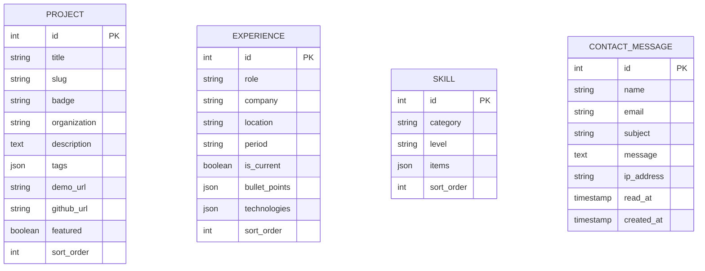

# Database Schema & Data Models

## 1. Entity Relationship Overview
The application utilizes SQLite with 4 primary models: `Project`, `Experience`, `Skill`, and `ContactMessage`.

## 2. Table Definitions

### `projects`
- `id` (INTEGER, Primary Key)
- `title` (VARCHAR 255): Display name of project
- `slug` (VARCHAR 255, Unique): URL-safe identifier
- `badge` (VARCHAR 255, Nullable): Category flag (e.g. `Hardware / IoT`, `SaaS Platform`)
- `organization` (VARCHAR 255, Nullable): Sponsoring entity or context
- `description` (TEXT): Architectural summary and technical impact
- `tags` (JSON): Array of technology tags
- `demo_url` (VARCHAR 255, Nullable): Public URL
- `github_url` (VARCHAR 255, Nullable): Source code repository
- `featured` (BOOLEAN, Default: `true`): Visibility toggle
- `sort_order` (INTEGER, Default: `0`)

### `experiences`
- `id` (INTEGER, Primary Key)
- `role` (VARCHAR 255): Job title
- `company` (VARCHAR 255): Employer name
- `location` (VARCHAR 255, Nullable): Geographic and remote setting
- `period` (VARCHAR 255): Time span
- `is_current` (BOOLEAN, Default: `false`): Currently active role
- `bullet_points` (JSON): Array of achievements and responsibilities
- `technologies` (JSON, Nullable): Array of primary tools utilized
- `sort_order` (INTEGER, Default: `0`)

### `skills`
- `id` (INTEGER, Primary Key)
- `category` (VARCHAR 255): Domain grouping (e.g. `Backend & APIs`, `DevOps & Infra`)
- `level` (VARCHAR 255): Proficiency tier (`Expert`, `Advanced`, `Specialist`, `Intermediate`)
- `items` (JSON): Array of specific tools, protocols, and frameworks
- `sort_order` (INTEGER, Default: `0`)

### `contact_messages`
- `id` (INTEGER, Primary Key)
- `name` (VARCHAR 100): Sender name
- `email` (VARCHAR 150): Sender email address
- `subject` (VARCHAR 200): Message title
- `message` (TEXT): Inquiry payload
- `ip_address` (VARCHAR 45, Nullable): Client IP address for audit
- `read_at` (TIMESTAMP, Nullable): Read status marker
- `created_at` / `updated_at` (TIMESTAMP)
